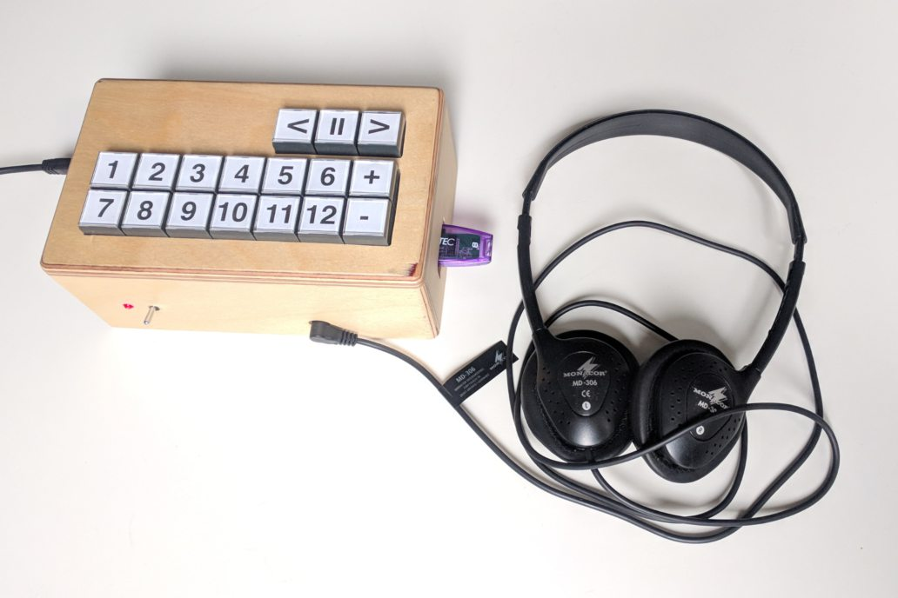

# senioren-mp3: Simple Raspberry Pi based audio player

This project is a simple audio player that runs on a Raspberry Pi, designed to be senior friendly.



Just plug in a USB flash drive with up to 12 audio files (supported are .wav, .mp3, .ogg, .opus).
You can then play one of the files by pressing the corresponding button.
In addition, there are two buttons for volume control, a play/pause button and two buttons for skipping forward or backward 15 seconds.
The device remembers the volume level and playback position, just press play after turning it back on and it will continue where you left off.
It is safe to unplug the USB drive and plug in another one when the player is turned on.

## Building the hardware

You will need:

- a Raspberry Pi (I used Model B+; newer models should also work but might require build configuration changes)
- a microSD card
- 17 buttons (15 if you only want 10 selection buttons)
- some wires
- a case to put in everything above
- a power supply
- a pair of headphones or speakers
- a USB flash drive with some audio files

### Step 1

Build the image (see below) and [flash it to the microSD card](https://www.raspberrypi.com/documentation/computers/getting-started.html#install-an-operating-system).

Install the card in the Raspberry Pi.

### Step 2

Install the buttons on the case.

Connect the buttons to the GPIO header of the Pi.
When a button is pressed, the corresponding GPIO pin should be connected to ground.

The pins are assigned as follows ([pin layout](https://www.raspberrypi.com/documentation/computers/raspberry-pi.html#gpio-and-the-40-pin-header)):

- Select pins (from 1 to 12): 2, 3, 4, 17, 27, 22, 10, 9, 11, 7, 8, 25
- Volume down: 24
- Volume up: 23
- Skip backwards: 14
- Play/pause: 15
- Skip forwards: 18

## Building and working on the software

This project is based on [Buildroot](https://buildroot.org/).
The application itself is written in [Go](https://golang.org/), and uses [GStreamer](https://gstreamer.freedesktop.org/) for audio playback.

### Requirements

You need all the [buildroot requirements](https://buildroot.org/downloads/manual/manual.html#requirement).

### Setup

This takes a while, as it has to compile *a lot* of stuff.

```
git clone --branch 2019.11 https://git.busybox.net/buildroot
git clone https://github.com/jscissr/senioren-mp3
mkdir build && cd build
make O=$PWD BR2_EXTERNAL=../senioren-mp3 -C ../buildroot raspberrypi_senioren_mp3_defconfig
make
```

### Making changes

To change the Buildroot configuration: `make nconfig`  
To save the configuration to the defconfig file: `make savedefconfig`

Buildroot is not so smart, you have to tell it whenever you change something to make sure that part gets rebuilt.

To rebuild the application: `make go-mp3player-rebuild`

### Running commands on the device

Connect the Pi to the network and to a monitor.
You should see the IP address on the screen.

You can connect using `telnet`, user `root`, password `root`.

If you don't want to reflash the microSD card whenever you change the application, you can do the following:
Start an http server on your computer with `cd build/go-mp3player/bin && python -m SimpleHTTPServer 8080` and open port 8080 in the firewall.
On the device, run `kill $(pidof go-mp3player) && cd /tmp` once, then to reload the application `rm -f go-mp3player && wget http://ip-address-of-your-computer:8080/go-mp3player && chmod +x go-mp3player`, and run it with `./go-mp3player`.

## Possible improvements

- When the audio starts or stops, there can be a pop, because it just does a hard cut. To fix this there should be a short (milliseconds) fade-in/out.
- When pressing a volume button, there is a half-second delay until the volume changes. Also, there can be a small pop. Ideally, the volume should change with no delay and a short fade.
- The device takes about 9 seconds to boot. This could be optimized.
- When plugging in a USB drive, it takes 2.5 seconds until it is ready to play. Almost all this time is spent by the kernel detecting and attaching the disk, I don't know if this could be optimized.

## License

MIT, see LICENSE file.

Raspberry Pi is a trademark of the Raspberry Pi Foundation.
